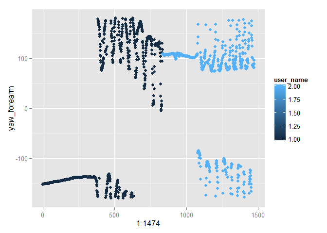

# Practical Machine Learning - Course Project
Germán Luna  
Wednesday, November 04, 2015  
## Summary

A random forest model is fitted to weight-lifting sensor data to determine how
well a weight lifting exercise is performed. The data was cleaned and most pre-existing features were discarded in favor of raw sensor angle data, using cosine and sine transformations to yield new features. The random forest achieved an out-of-bag error of 0.73% utilizing these features alone, yet faced an average error rate higher than 22% when trying to generalize across subjects. Reasons for this increase in error, as well as possibilities for reducing it, are discussed. For more information about the source data see <http://groupware.les.inf.puc-rio.br/har>.


```r
library(downloader)
library(lubridate)
library(randomForest)
```

```
## randomForest 4.6-10
## Type rfNews() to see new features/changes/bug fixes.
```

```r
library(caret)
```

```
## Loading required package: lattice
## Loading required package: ggplot2
```

```r
set.seed(323232)
```


```r
trainingUrl <- "https://d396qusza40orc.cloudfront.net/predmachlearn/pml-training.csv"
testingUrl <- "https://d396qusza40orc.cloudfront.net/predmachlearn/pml-testing.csv"
download(trainingUrl,"pml-training.csv",mode="wb")
download(testingUrl,"pml-testing.csv",mode="wb")
train <- read.csv("pml-training.csv",stringsAsFactors=FALSE)
test <- read.csv("pml-testing.csv",stringsAsFactors=FALSE)
```

## Data preparation


```r
# Change subject names to numerical ids
users <- unique(train$user_name)
userId <- 1:6; names(userId)<- users
train$user_name <- userId[train$user_name]

# Change exercise labels to numerical labels
exerciseId <- 1:5; exercises <- unique(train$classe)
names(exerciseId) <- exercises
train$classe <- exerciseId[train$classe]


# Parse the daily timestamps.
times <- sapply(1:dim(train)[1],function(i)paste0(train$raw_timestamp_part_1[i],
                                                  ".",
                                                  train$raw_timestamp_part_2[i],
                                                  collapse="")   )
train$timestamp <- as.POSIXct(as.numeric(times), origin="1970-01-01",tz="GMT")

# Parse time_stamps in order to sort by order of recording and exerciseId
train$cvtd_timestamp <- parse_date_time(train$cvtd_timestamp,"d!/m!/Y! H!:M!")
train <- train[order(train$cvtd_timestamp,train$user_name,train$classe,train$timestamp),]
```

## Feature creation and omission

Because exercises follow a repetitive pattern with well defined relative positions
of joint angles, it makes sense that the angle information contained in yaw, roll and
pitch would for the most part suffice for classification. Windowed standard deviations
and averages (and other windowed features), while helping capture the time-dependence of exercise execution unfortunately also introduce issues of speed of execution bias.
Consequently, all of the windowed features were discarded and only the raw angle
measurements of yaw, roll and pitch were used. Similarly, to account for the periodic nature of angle variables we transformed the angles into cosine-sine pairs.


```r
# Transformation for angles into cosine, sine pairs.
toCircle <- function(angle,shiftdown=function(x) 0){angle <- angle-shiftdown(angle);
                                    return(cbind(cos(2*pi*angle/360),
                                                 sin(2*pi*angle/360)))}

# Extracting the position measurements.
# preffixes: roll,pitch, yaw. Suffixes: belt, arm, forearm, dumbbell
preffixes <- c("roll","pitch","yaw")
suffixes <- c("belt","arm","forearm","dumbbell")

rawvarNames <- vector(length=3*4,mode="character")
for(i in 1:4){
      for(j in 1:3){
            rawvarNames[3*(i-1)+j] <- paste0(preffixes[j],"_",suffixes[i],collapse="")
      }
}

trainA <- data.frame(classe=train$classe, user_name = train$user_name)
for(name in rawvarNames){
      newnameCos <- paste0("Cos_",name,collapse="")
      newnameSin <- paste0("Sin_",name,collapse="")
      newvars <- toCircle(train[name])
      trainA[newnameCos] <- newvars[,1]
      trainA[newnameSin] <- newvars[,2]
}
```

## Fitting a random forest

We start by fitting a random forest to the data, using 6-fold cross-validation. Though not strictly required for random forests, performing the cross-validation anyway can serve as a sanity check to compare against if the out-of-bag error seems ridiculously
small.


```r
# Assesses CV error at the observation level.
cvFoldsTest <- createFolds(trainA$classe,k=6)
percAcc <- vector(length=6,mode="double")
i <- 1
for(testIds in cvFoldsTest){
      rf_model <- randomForest(as.factor(classe)~.,data=trainA[-testIds,-2],
                               ntree=1e3, replace=TRUE)
      N <- length(testIds)
      percAcc[i] <- sum(predict(rf_model,
                        newdata=trainA[testIds,-2])==trainA[testIds,]$classe)/N
      i<- i+1
}
print(percAcc)
```

```
## [1] 0.9896024 0.9920514 0.9932742 0.9899083 0.9929664 0.9902141
```

```r
# Fullrandom forest model
rf_model <- randomForest(as.factor(classe)~.,data=trainA[,-2],ntree=1e3,
                         replace=TRUE)
rf_model
```

```
## 
## Call:
##  randomForest(formula = as.factor(classe) ~ ., data = trainA[,      -2], ntree = 1000, replace = TRUE) 
##                Type of random forest: classification
##                      Number of trees: 1000
## No. of variables tried at each split: 4
## 
##         OOB estimate of  error rate: 0.73%
## Confusion matrix:
##      1    2    3    4    5 class.error
## 1 5570   10    0    0    0 0.001792115
## 2   22 3727   41    6    1 0.018435607
## 3    0   15 3394   12    1 0.008182350
## 4    1    5   10 3199    1 0.005286070
## 5    0    3    9    7 3588 0.005267535
```

Success! Our random forest model is able to predict with very high accuracy the 
kind of exercise being performed regardless of subject and cross-validation shows that it is a robust error estimate. 


## Generalizing to other subjects

Since the goal of such a
model is to be used to provide feedback to a more general population of users I 
examined the effect of leave-1-subject-out cross-validation.


```r
# Leave-1-subject cross-validation
percAcc <- vector(length =5,mode="double")
for(i in 1:5){
      excludeSubject_i <- trainA$user_name!=i
      rf_model <- randomForest(as.factor(classe)~.,
                               data=trainA[excludeSubject_i,-2],
                               ntree=1e3,replace=TRUE)
      N <- sum(!excludeSubject_i)
      percAcc[i] <- sum(predict(rf_model,
            trainA[!excludeSubject_i,-2])==trainA[!excludeSubject_i,]$classe)/N
}

print(percAcc)
```

```
## [1] 0.2940231 0.4440613 0.1896197 0.3928167 0.2459283
```

Similarly as was discovered by the researchers in the original article, I found
that excluding one subject has dramatic negative effects on classification 
accuracy. In the paper, this drop was attributed to small sample size and other limiting experimental factors. However, in exploring the training data, we find
that there are (semi)systematic differences in the angles recorded for the same exercise
across subjects. Namely for the variable `yaw_forearm`, we  see that in Subject
`carlitos` the initial angle is being recorded at -150 degrees, whereas for Subject `pedro` the initial angle is approximately 106 degrees.


```r
userId[1:2]
```

```
## carlitos    pedro 
##        1        2
```

```r
g <- ggplot(data=train[train$classe==1 & (train$user_name %in% c(1,2)),],aes(1:1474,yaw_forearm)) + geom_point(aes(color= user_name) )
g
```

 

Note this is the forearm and -150 degrees is closer to what you would see in an Ultimate Fighter match than weightlifting.
We can rule out injury only if we assume these measurements are being taken with respect to a reference system. With such an assumption, this implies that the
direction which the test subject was facing results in a bias of the `yaw_forearm` variable (and possibly other yaw variables)!

Though this variation can be removed from the analyzed subjects (albeit
at the cost of some work to decide how to algorithmically do so), it still impairs
our ability to generalize to a new subject outside the study because we would need a real-time correction algorithm to account for the subjects orientation. Probably the most efficient way to do this would be to have the reference sensor treat the starting
position as yaw == 0 instead of trying to solve this algorithmically.

## References

1) Velloso, E.; Bulling, A.; Gellersen, H.; Ugulino, W.; Fuks, H. Qualitative Activity Recognition of Weight Lifting Exercises. Proceedings of 4th International Conference in Cooperation with SIGCHI (Augmented Human '13) . Stuttgart, Germany: ACM SIGCHI, 2013.

